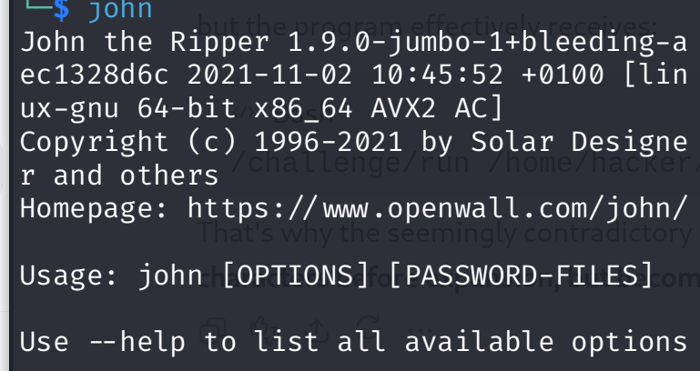
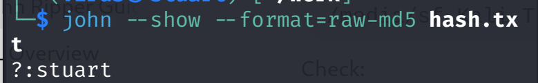

#  John the Ripper — Password Auditing Lab

A hands-on cybersecurity laboratory. illustrating on the ude of John the Ripper on Linux.

##  Overview

This project documents a controlled cybersecurity laboratory using
John the Ripper to understand how password auditing and dictionary
attacks work.

The laboratory was performed using test credentials and hashes
created specifically for educational purposes and learning.

##  Objectives

- Understand password hashing
-Introduction to JTP
- Generate a test MD5 hash
- Perform a dictionary attack
- Use password wordlists
- Analyze John the Ripper output
- Troubleshoot common errors
- Understand the security risks of weak password John the Ripper — Password Auditing Lab

A hands-on cybersecurity laboratory demonstrating password auditing with John the Ripper on Linux.

## Introduction
John the ripper is a free open source password cracking tool used to recover plaintext password from cryptograph hashes from wordlists, mask patterned.

Back to its history: JTP is maintained by openwall since 1986 which makes it older and more used then most of the hash crackers.

## Modes used in john the ripper
In my study i looked at three(3) modes:
  - Single crack mode
  - Wordlist mode
  - Incremental mode

# The flow of the study
Since i carried out the study using kali linux, JTP come installed i proved this by running command `--john--` to known the version.

```bash
 john 
 
 ```


# Some of the frags / options used in the study JTP

 1. If a John the Ripper session is interrupted, the `--restore`
option can be used to continue the previous session.

```bash
john --restore
```

 2. To retrieve the cracked password, can use `--show--` followed by the file which had the hash 
 ```bash 
 john `--show` hash.txt
 ```
 

 3. To show the john sessions. i used -         `--status--` 
 ```bash 
 john `--status--`
 ```
 - `--list=formats--` Lists the supported password-hash formats.


